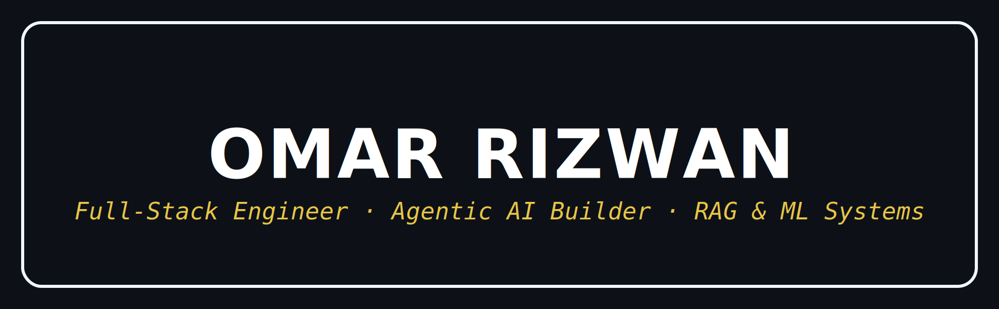

<!-- Banner: replace main.png with your own banner image, OR use the capsule-render line below instead -->

<!-- Alternative banner (delete the line above and uncomment this if you don't have a main.png):

-->

### `Full Stack Developer` · `AI/ML Engineer` · `Agentic AI`

*Full-Stack Software Engineer building clean, scalable software at the intersection of AI and real-world applications. Currently shipping B2B SaaS on Angular + ASP.NET Core, and building multi-agent LLM pipelines, RAG systems, and production-scale ML.  *

 

    
    
    
    
  

  

    
    
    
  

---

## Tech Stack

 

---

## Here’s my GitHub Score, updated daily:

<!--SCORE_START-->
🏆 **GitHub Score:** 0

📊 Formula: (Commits ×0.5 + Stars ×5 + Forks ×3 + PRs ×4 + Issues ×2 + Followers ×2)

🎮 **Level 1**
[░░░░░░░░░░] 0%
<!--SCORE_END-->

---

## 🚀 Projects

- 🤖 **[Digital Matters — RAG Chatbot](https://github.com/ozr0013/Digital-Matters---RAG-Chatbot-Utah-Digital-Newspaper)** — Retrieval-Augmented Generation over ~9M Utah Digital Newspapers records, sub-400ms latency *(Python, FAISS/ChromaDB, LLMs)*
- 🧠 **StudyAgent** — Multi-agent LLM tutoring system for adaptive CS/ML concept mastery *(Ollama, ChromaDB, SQLite, Streamlit)*
- 💬 **[Realtime Chat](https://github.com/ozr0013/realtime-chat)** — Full-stack messaging app with WebSocket communication and multi-room support *(Java, Spring Boot)*
- 🛒 **[E-Commerce API](https://github.com/ozr0013/ecommerce-api)** — RESTful backend for catalog, cart, orders, and auth *(Java, Spring Boot, JPA)*
- 🍽️ **[Saltify Grill](https://github.com/ozr0013/Saltify-grill)** — Digital menu platform for a Salt Lake City restaurant *(JavaScript, Node.js)*
- 🖥️ **tsh** — Unix shell with full job control, signal handling, and pipe support *(C)*

---

<h2 align="center">  Github Statistics</h2>

<!-- Row 1: 3 equal columns -->

<!-- Row 2: streak + stats -->

<!-- Row 3: profile details + activity graph -->

---

## 🤝 Connect With Me

*Always open to collaborating on interesting projects, discussing AI/ML and agentic systems, and contributing to community tooling — fixing bugs, improving docs, building reusable components.*

---
